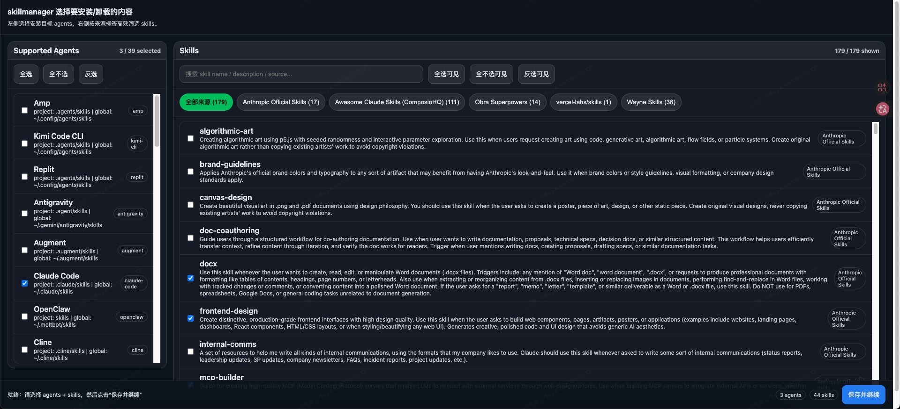

# skillmanager（`@wang121ye/skillmanager`）

[中文](./README.md) | [English](./README_EN.md)

跨平台（Windows / Linux / macOS）的 **Agent Skills 管理器**：把「官方 skills + 第三方 skills 仓库 + 你自己的 skills 仓库」统一做 **安装（install）/更新（update）/卸载（uninstall）**，并支持按 `project/global` + 多 agent 目录安装。

本项目 **基于 `openskills`** 实现安装与 `AGENTS.md` 同步。

## 30 秒上手

```bash
# 1) 默认安装（project 作用域），交互选择 skills + agents
skillmanager install

# 2) 全局安装到 ~ 目录下各 agent 路径
skillmanager install --global

# 3) 用 Web UI 选择（左侧 agents，右侧 skills 来源标签）
skillmanager webui
```

## 为什么好用（相比手动拷贝）

- 一次安装/更新可覆盖多个 agent 目录（不再手工复制同一份 skills）
- 默认 project、可切 global，路径不用记
- `install <repoOrRef>` 会自动写入 `sources.json`，后续 `config push/pull` 可同步
- profile 不只记 skill 选择，还会按 scope 记忆 agent 选择
- Web UI 支持来源标签、搜索、对“当前可见项”批量全选/反选
- `openskills sync` 改为显式触发（`--sync`），避免每次操作都改 `AGENTS.md`

## 命令速览（完整）

| 命令 | 作用 | 常用示例 |
| --- | --- | --- |
| `skillmanager install [repoOrRef]` | 交互选择 skills + agents 后安装；支持指定单一来源并自动写入 `sources.json` | `skillmanager install --global` |
| `skillmanager update` | 按 profile 选择集 + scope + agent 选择进行“重装式更新” | `skillmanager update --profile laptop` |
| `skillmanager uninstall [skillNames...]` | 卸载选中的 skills；先选 agents 再执行删除 | `skillmanager uninstall xlsx` |
| `skillmanager webui` | Web UI 安装模式（可搜索、按来源标签筛选、可见项批量操作） | `skillmanager webui --project` |
| `skillmanager webui --mode uninstall` | Web UI 卸载模式 | `skillmanager webui --mode uninstall --global` |
| `skillmanager source ...` | 管理来源：`list/add/remove/enable/disable` | `skillmanager source add owner/repo` |
| `skillmanager config ...` | 管理默认 profile 与远端同步配置：`show/set-default-profile/set-remote-profile-url/push/pull` | `skillmanager config push --profile laptop` |
| `skillmanager paths` | 打印配置目录、缓存目录、仓库缓存目录、manifest 实际路径 | `skillmanager paths` |

## 环境变量速览

| 变量 | 用途 |
| --- | --- |
| `SKILLMANAGER_PROFILE` | 临时覆盖默认 profile（等效于多数命令传 `--profile`） |
| `SKILLMANAGER_PROFILE_URL` | 临时覆盖远端配置 URL（供 `config push/pull` 使用） |
| `SKILLMANAGER_CONCURRENCY` | 默认并发扫描数（可被命令行 `--concurrency` 覆盖） |
| `SKILLMANAGER_AUTO_REFRESH` | 仓库缓存自动刷新开关（默认开启；设为 `0` 可关闭） |

## 环境要求与兼容性（重要）

`skillmanager` 会调用系统里的 `git` 拉取/更新 skills 来源仓库，并通过 `openskills` 执行安装与 `AGENTS.md` 同步。因此你的环境版本过低时，可能出现“看起来配置没问题但某些机器上失败”的情况。

- **Node.js（用于运行 openskills）**：建议 **>= 20.6.0**
  - 低于该版本可能出现语法错误（例如依赖使用了 RegExp `/v` flag）。
- **openskills**：建议 **>= 1.5.0**（本项目依赖与运行时行为以该版本为基准）
- **git**：建议 **>= 2.34.0**
  - 低版本在 GitHub HTTPS + partial clone（如 `--filter=blob:none`）场景下，可能更容易遇到 TLS/gnutls 相关中断（如 `gnutls_handshake()`）。

常见规避方案：

- **升级 git / Node / openskills**（推荐根治）
- **降低并发**（网络/中间设备对并发连接敏感时）：

```bash
skillmanager webui --concurrency 1
```

### 缓存自动刷新（避免“只看到旧的 skills”）

为避免第三方用户忘记更新缓存，`skillmanager` 在扫描来源仓库时会检查本地缓存是否落后于远端：

- 如果检测到缓存落后，默认会**自动重新拉取**最新仓库。
- 如需手动控制，可使用 `--force-refresh` 强制刷新，或设置 `SKILLMANAGER_AUTO_REFRESH=0` 关闭自动刷新。

示例：

```bash
skillmanager webui --force-refresh
skillmanager install --force-refresh
skillmanager update --force-refresh
```

## 安装与使用

### 全局安装（推荐）

```bash
npm i -g @wang121ye/skillmanager
skillmanager install
```

### 直接 npx（无需安装）

```bash
npx @wang121ye/skillmanager install
```

> 说明：你最初写的 `npx skillmanager bootstrap` 只有在发布"非 scope 包名"时才成立。  
> 现在按 scoped 包发布为 `@wang121ye/skillmanager`，对应 npx 用法是 `npx @wang121ye/skillmanager ...`，但执行的命令名仍然叫 `skillmanager`（由 `bin` 决定）。

## 关键能力

### 1) 一键安装（默认装"全部来源的全部 skills"）

```bash
skillmanager install
```

### 命令行交互式选择（类似 openskills）

默认 `skillmanager install` 会进入两步交互：
- 第 1 步：选择 skills（按来源分组）
- 第 2 步：选择要安装到哪些 agents（Supported Agents）

终端交互支持：
- 空格选择/取消
- a 全选，i 反选
- h 顶部，e 底部
- [ / ] 切换分组
- Esc 退出，Enter 确认

### 2) 安装时启用 Web UI 选择（默认全选，可批量全选/全不选/反选/搜索）

```bash
skillmanager webui
# 或指定 scope
skillmanager webui --project
skillmanager webui --global
```

Web UI 交互特性：

- 左侧 `Supported Agents` 列表独立滚动，快速勾选目标 agent
- 右侧 skills 按来源标签切换（`全部来源` + 各 source）
- `全选/全不选/反选` 默认作用于“当前可见 skills”（当前标签 + 当前搜索）
- 安装与卸载模式都使用同一套 agents + skills 选择体验

你也可以用某个 profile 名称（会保存选择集到该 profile，包含 skills 与按 scope 记忆的 agents）。**多数情况下不需要显式传 `--profile`**，直接用默认 profile（通常是 `default` 或你在 `skillmanager config set-default-profile` 里设置的值）即可：

```bash
skillmanager webui --profile laptop
skillmanager install --profile laptop
```

### 3) 直接安装单个来源（并自动写入 sources）

```bash
skillmanager install https://github.com/wangyendt/wayne-skills
# 或
skillmanager install wangyendt/wayne-skills
```

当你传入 `repoOrRef` 时，`skillmanager` 会自动将该来源写入用户 `sources.json`（已存在则复用），这样后续 `config push/pull` 也能同步这条来源。
如果该来源在 `sources.json` 里已存在但为禁用状态，安装时会自动启用。

## 把 `--profile laptop` 设为默认（推荐）

设置一次默认 profile 后，绝大多数命令都可以不写 `--profile`：

```bash
skillmanager config set-default-profile laptop
skillmanager webui
skillmanager install
```

你也可以用环境变量临时覆盖默认 profile：

```bash
SKILLMANAGER_PROFILE=laptop skillmanager webui
```

## 配置同步：换电脑快速部署

`skillmanager` 支持将配置上传到云端（如阿里云 OSS、AWS S3 等），换电脑时一键拉取，实现配置同步。

**同步内容包括：**
- ✅ `sources.json` - 所有 skills 来源仓库配置
- ✅ `profiles/[profile].json` - 选中的 skills 列表 + 按 scope 记忆的 agent 选择

> 安全提示：**开放公共写权限非常危险**，任何人都可以篡改你的配置。更安全的做法是使用签名 URL、私有桶 + 凭证、或 Git 私有仓库。

### 1) 设置远端基础 URL（只需一次）

```bash
skillmanager config set-remote-profile-url https://<bucket>.<region>.aliyuncs.com/skillmanager/
```

注意：
- URL 是**基础路径**（以 `/` 结尾），工具会自动拼接 `sources.json` 和 `profiles/[profile].json`
- 需要在云存储服务中设置相应目录的读写权限

**阿里云 OSS 权限配置示例：**

在 OSS 控制台的 "Bucket 授权策略" 中添加：
- 授权资源：`your-bucket/skillmanager/*` （注意 `/*` 通配符）
- 授权操作：读/写（或 `PutObject`、`GetObject`）

你也可以不写入本地配置，改用环境变量（更适合 CI/临时机器）：

```bash
export SKILLMANAGER_PROFILE_URL=https://<bucket>.<region>.aliyuncs.com/skillmanager/
```

### 2) 推送配置到云端

```bash
# 使用默认 profile
skillmanager config push

# 指定 profile 名称
skillmanager config push --profile laptop
```

**推送内容：**
- `sources.json` → `https://...com/skillmanager/sources.json`
- `profiles/laptop.json` → `https://...com/skillmanager/profiles/laptop.json`

### 3) 新电脑拉取配置

```bash
# 使用默认 profile
skillmanager config pull

# 指定 profile 名称
skillmanager config pull --profile laptop
```

**拉取后直接安装：**

```bash
skillmanager config pull --profile laptop
skillmanager install --profile laptop
```

### 4) 安装位置与 scope

- 默认（或显式 `--project`）：安装到当前项目目录下的各 agent 路径
- `--global`：安装到 `~/` 下的各 agent 全局路径
- `--project` 与 `--global` 互斥，未指定时等同 `--project`
- 如果你选择的多个 agents 映射到同一路径，`skillmanager` 会自动去重（同一路径只执行一次安装）

示例：

```bash
# 默认 project
skillmanager install

# 显式 project
skillmanager install --project

# global
skillmanager install --global
```

### 5) 同步 `AGENTS.md`

默认**不执行** `openskills sync`。如需生成/更新当前目录的 `AGENTS.md`，请显式加 `--sync`。

- 执行同步（默认输出 `AGENTS.md`）：

```bash
skillmanager install --sync
```

- 指定输出文件（需配合 `--sync`）：

```bash
skillmanager install --sync --output AGENTS.md
```

> `install` / `update` / `uninstall` / `webui` 均为默认不 sync；只有传 `--sync` 时才会执行 `openskills sync`。
> `--sync` 与 scope（project/global）解耦：是否 sync 只取决于你是否显式传 `--sync`。

### 6) dry-run（只打印要装什么，不实际安装）

```bash
skillmanager install --dry-run
```

`dry-run` 会同时打印：

- 即将安装的 skills（最多前 30 个）
- 本次解析出的目标目录（按 agent 去重后的目录集合）

## 更方便地添加/管理第三方仓库

以后不需要手动去编辑 `sources.json`，可以直接用命令写入用户配置：

```bash
skillmanager source add https://github.com/obra/superpowers
skillmanager source add ComposioHQ/awesome-claude-skills
skillmanager source list
```

禁用/启用/删除：

```bash
skillmanager source disable superpowers
skillmanager source enable superpowers
skillmanager source remove superpowers
```

> `source add` 支持输入 `owner/repo` 或 GitHub URL（也支持 `git@github.com:owner/repo.git`）。

## 更新已安装 skills（无论哪种来源）

### 默认更新（推荐）

默认会优先按 profile 选择集更新（显式 `--profile` 优先，否则使用默认 profile），并按该 profile 记忆的 agent 选择 + 当前 scope（默认 project）重装：

```bash
skillmanager update
```

如果目标 profile 不存在或没有有效选择集，会默认更新“当前可见来源中的全部 skills”。

指定 scope：

```bash
skillmanager update --project
skillmanager update --global
```

### 指定 profile 更新（子集安装最稳）

```bash
skillmanager update --profile laptop
```

需要临时调整选择集：先用 Web UI 更新 profile，再执行 update：

```bash
skillmanager webui --profile laptop
skillmanager update --profile laptop
```

### 强制使用 openskills 原生更新链路

```bash
skillmanager update --openskills
```

说明：`--openskills` 会走 openskills 原生更新逻辑，不使用 profile 的 skills/agents 选择集。

## 卸载 skills

### 用 Web UI 勾选要卸载的 agents + skills（推荐）

```bash
skillmanager webui --mode uninstall
```

### 直接按名称卸载（仍会先交互选择 agents）

```bash
skillmanager uninstall algorithmic-art xlsx
```

按 scope 卸载：

```bash
skillmanager uninstall --project
skillmanager uninstall --global
# 可选：指定 profile 读取/保存 agent 选择记忆
skillmanager uninstall --profile laptop
```

### 清空目标目录（危险操作，需要显式 --all）

```bash
skillmanager uninstall --all
```

说明：`--all` 的作用范围是“当前 scope + 当前选中的 agents 对应目录”。

## Web UI 截图（推荐）

建议把截图放到仓库路径：

- `docs/images/webui-overview.png`

README 中可直接引用：



## Skills 来源配置（官方 / 第三方 / 你自己的）

skillmanager 会在第一次运行时，把内置的 `manifests/sources.json` 复制到你的用户配置目录，之后你只需要编辑 **用户配置文件**即可：

```bash
skillmanager paths
```

会打印出类似：

- `manifest: C:\Users\<you>\AppData\Roaming\skillmanager\sources.json`（Windows）
- macOS/Linux 则在 `~/.config/skillmanager/sources.json` 附近

`sources.json` 里维护三类来源（你可以继续追加第三方仓库）：

- 官方：`anthropics/skills`
- 你的：`wangyendt/wayne-skills`
- 第三方：自行添加（`enabled: true`）

## Agent 路径映射来源（引用）

本项目内置的 `manifests/agents.json` 路径映射，依据以下上游资料整理（非逐字拷贝）：

- 仓库：`vercel-labs/skills`
- 文档章节：`Supported Agents`
- 许可证：MIT
- 访问日期：2026-05-05

维护约定：

- 以后更新 agents 映射时，以 `Supported Agents` 表格为唯一来源
- 维护流程见 `docs/agent-mapping-maintenance.md`

参考链接：

- https://github.com/vercel-labs/skills
- https://github.com/vercel-labs/skills?tab=readme-ov-file#supported-agents
- https://github.com/vercel-labs/skills/blob/main/LICENSE

## 发布到 npm（给你未来用）

你要发布 scoped 包到 npm，一般是：

```bash
npm login
npm publish --access public
```

（你提到的 npm 账号是 `wang121ye`：确保你拥有 `@wang121ye` scope 的发布权限；发布 scoped 包通常需要 `npm publish --access public`，本项目已在 `publishConfig` 里默认设置为 public。）
